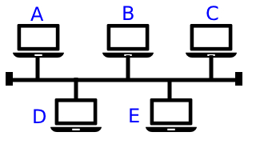
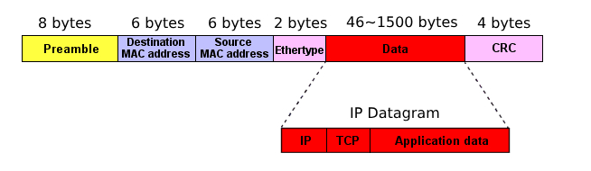

# 網路
> **網路設備**與**網路媒介**形成網路
網路設備: Hub、Switch、Router
網路媒介: 包誇有線與無線(wireless)

# Host(主機)
> 可以跟「網路設備」連線的機器

> 廣義: 可以設定IP的地方都稱主機，包誇 PC、連網列表機...

# Network Device(網路設備)
> 構成「網段」的設備，
> 包誇 Hub、Switch、Router

# Network Media(網路媒介)
> 可分為「有線傳輸媒介」及「無線傳輸媒介」

> 有線有雙絞線（Twisted pair）、同軸電纜 (Coaxial cable) 、光纖（Optical Fiber）及電力線 (Home Plug) 等

> 無線則包含了微波（Microwave）與紅外線（Infrared）等

# Hub(集線器)

如圖，孔1、2、3、4 稱為port，這些port可以透過Network Device接Network Media，例如透過網路線，接通Hub與電腦

## 協議(protocol)規格: Ethernet(乙太網路)

## 傳送資料: Share Bus(共享匯流排)
> 匯流排: 資料傳輸的通道

A要傳送資料給E，因為Shared Bus的關係，所有人都會收到資料，
但是不知道這筆資料是要傳給誰，需要透過Addressing(定址)來解決

## MAC (地址)
> 由 24bit廠商號碼 + 24bit流水號組成唯一號碼，每一個網路卡都會有唯一MAC
透過在資料前面加上MAC再傳送，就可以判斷資料是送給誰，MAC相同就收，不同就不收

# Ethernet Frame (乙太網路規格)

除了資料本身外還加入些資訊，包誇來源與目的地MAC

CRC用於檢驗資料傳送正確與否

# Hub 傳送資料
Source (送方)送資料給 Destination (收方)，因為Shared Bus的關係，每一個人都會收到資料，並比對 Destination MAC 與自己的 MAC相同與否，一樣就收，不一樣就不收

# Hub的問題
## 1. 排擠作用
> 一次只能有一個人使用，同時有兩個人以上傳送資料會產生碰撞，造成 garbage message，這些垃圾訊息還是會傳給所有人
## Collision Domain (碰撞區域)
> 會產生碰撞的區域