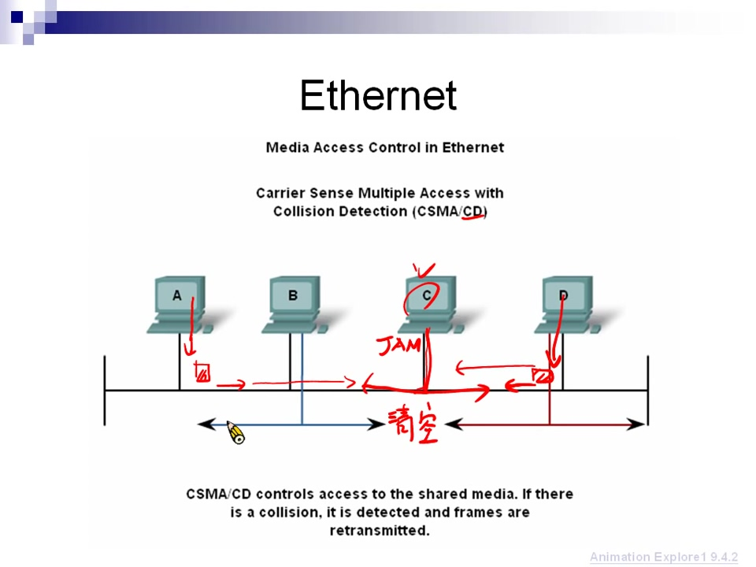
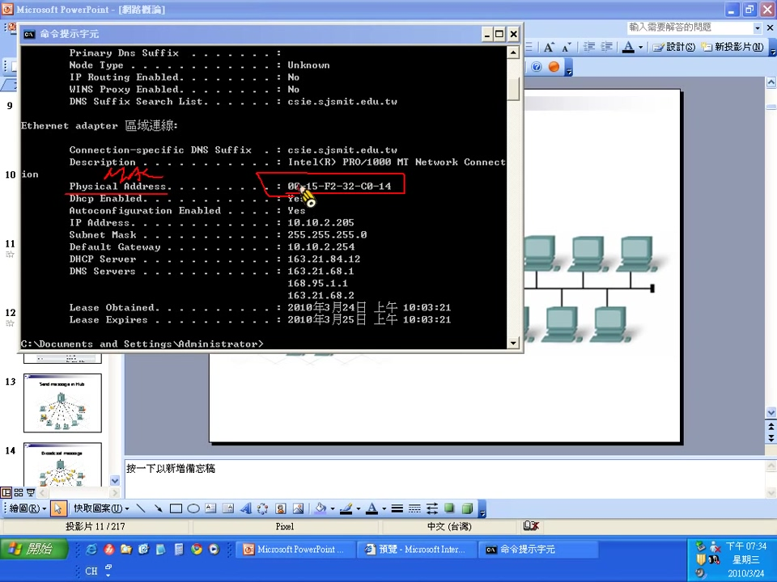
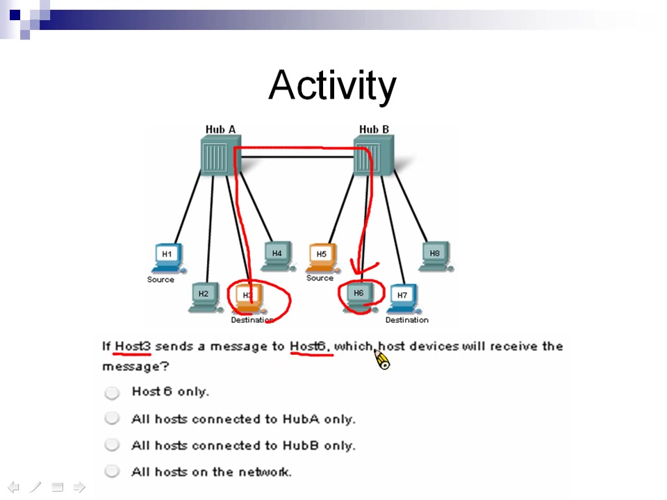
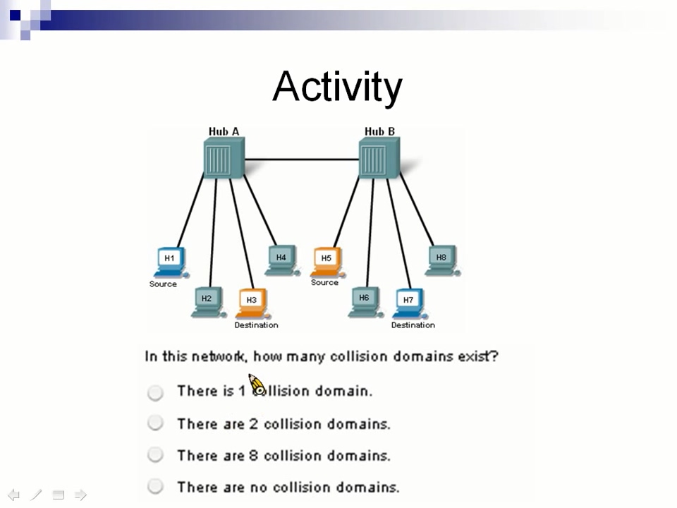
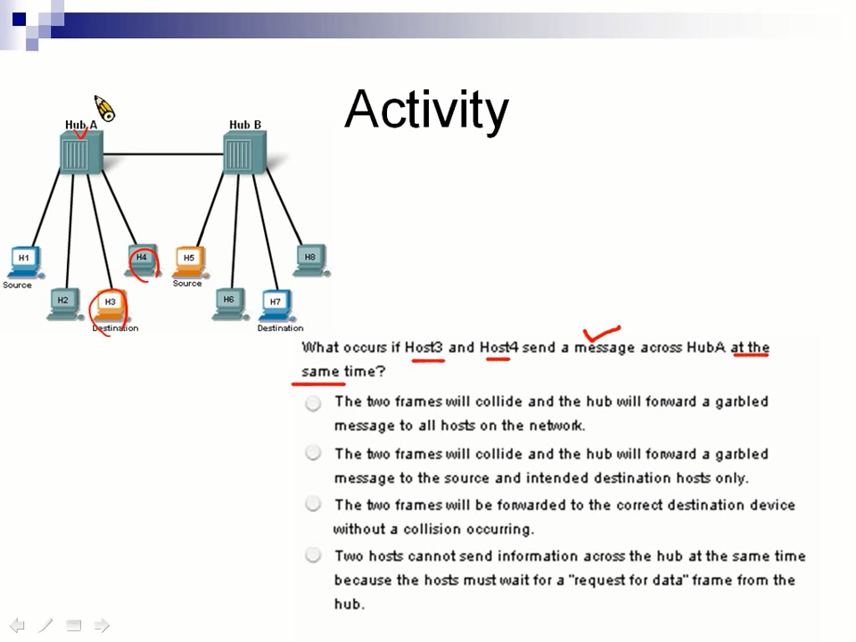

## Ethernet (乙太網路)解決碰撞問題
使用 CSMA/CD，降低碰撞次數，提升傳輸速率
#### 1. CSMA (Carrier Sense Multiple Access)

Carrier Sense: 偵測Shared bus(共享匯流板)目前有沒有送資料，如果有就不送資料，避免碰撞

Multiple Access (多重存取) : 只要接在Shared bus的電腦，都可以接資料與送資料

#### 2. CD (Collision Detection)

偵測到將有碰撞的發生，讓碰撞提早發生，縮短影響時間

A 和 D 想要送資料，透過 CSMA 確認目前 Shared bus目前無資料傳送，兩人同時發送資料，一定會發生碰撞，C 偵測到這件事，C 發出了稱為 JAM 的訊息，把 A 和 D發出的訊息提早清掉

A 和 D 會有隨機 back off time，來決定下次要送資料的時間，避免下次送資料繼續碰撞
## Physical Addressing (實體位置)
也就是MAC，總共48bit，4個一組組成16進位，總共12個
ex: `DD:DD:DD:DD:DD:DD`
OR `DD-DD-DD-DD-DD-DD`

#### 查看MAC方式
Windows CMD 輸入 `ipconfig /all`，Physical Address 即是 MAC 地址

#### 傳送資料
傳送資料除了資料本身，也需要包誇自己與目的地的 MAC，組成一個 Frame

Frame:
| Destination Address | Source Address    | Data              |
| ------------------- | ----------------- | ----------------- |
| CC:CC:CC:CC:CC:CC   | AA:AA:AA:AA:AA:AA | Encapsulated data |
| Frame Addressing                        |                   |

> Encapsulate (封裝): 把除了 Data 本身外其它資訊，加上去

## 練習題目
1. 3號要傳訊息給6號，哪些機器會收到訊息?

2. 這個網路有幾個碰撞區域?

3. 3號和4號同時傳送資料會發生甚麼事?

## 題目解答
1. 所有機器都會收到。 Hub1 與 Hub2 連接在一起，可以看做是一個 Shared bus。
2. 一個碰撞區域。 
3. 兩個訊息碰撞產生垃圾訊息，並傳送給所有人