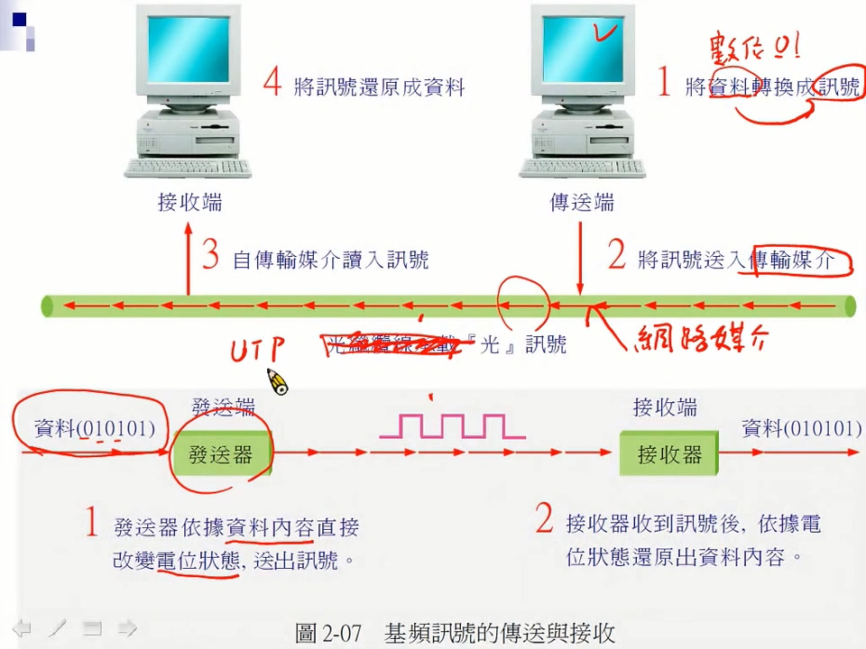
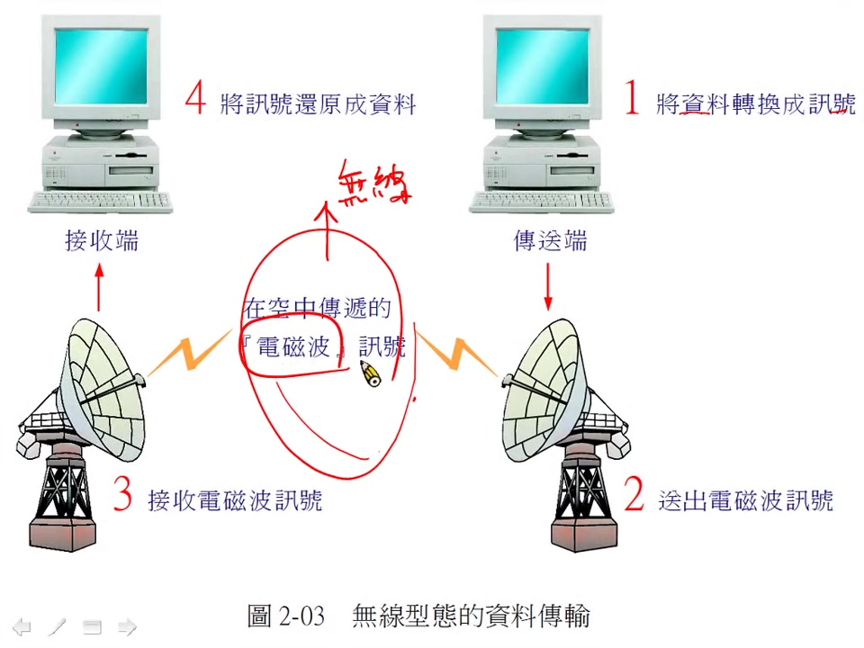
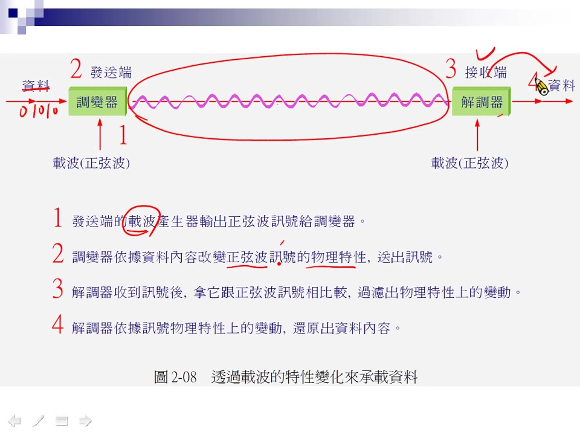

# OSI (Open System Interconnection) Model 網路模型
由 ISO (International Standards Organization) 國際標準組織所訂定

<table>
  <tr>
    <td>7</td>
    <td>Application</td>
    <td>應用層</td>
  </tr>
  <tr>
    <td>6</td>
    <td>Presentation</td>
    <td>表現層</td>
  </tr>
  <tr>
    <td>5</td>
    <td>Session</td>
    <td>交談層</td>
  </tr>
  <tr>
    <td>4</td>
    <td>Transport</td>
    <td>傳輸層</td>
  </tr>
  <tr>
    <td>3</td>
    <td>Network</td>
    <td>網路層</td>
  </tr>
  <tr>
    <td>2</td>
    <td>Data Link</td>
    <td>資料連結層</td>
  </tr>
  <tr>
    <td>1</td>
    <td>Physical</td>
    <td>實體層</td>
  </tr>
</table>

資料送的話從第7層開始處理，收的話從第1層開始處理。就像寄信一樣，先寫信、封裝在信封袋，再寄出一樣，每一層有一定的處理

## Layer 7 (L7) Application 應用層
應用程式，像是Browser (IE、Chrome) 使用HTTP協定，E-mail (Outlook) 送信使用SMTP，收信使用POP協定

每一個協定會對應一個port，像HTTP port是80
## Layer 6 (L6) Presentation 表現層
應用程式資料的表現方式，像是資料加密、資料的格式、資料結構
## Layer 5 (L5) Session 交談層
資料傳送前溝通的準備，包誇連線建立、管理

**上面三層 (L7 ~ L5) 都跟Application有關**
## Layer 4 (L4) 傳輸層
決定資料怎麼送，封包要切多大，分為兩種，一種是TCP像是掛號信，一種是UDP像是平信
## Layer 3 (L3) 網路層
一般是IP，即是住址
## Layer 2 (L2) 資料連結層
L2的地址是MAC
## Layer 1 (L1) 實體層
傳送的媒介，即是網路媒介，分為有線與無線傳送，電腦傳送訊號的時候以數位訊號(0、1...)傳送 
光纖傳送以光的折射，雙軸線以電壓訊號

### [瞭解更多OSI...](https://ithelp.ithome.com.tw/articles/10000021)

## 有線傳輸

將資料轉為數位訊號(0、1)透過網路媒介(線路)傳送給接收端

## 無線傳輸

無線通過電磁波傳輸，接收端透過波形判斷接收到的資料是0還是1，轉成資料