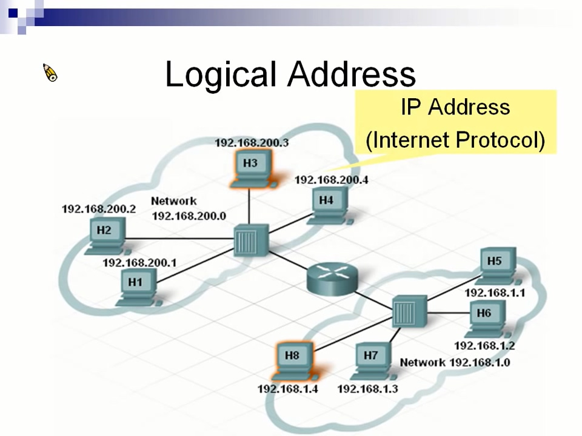
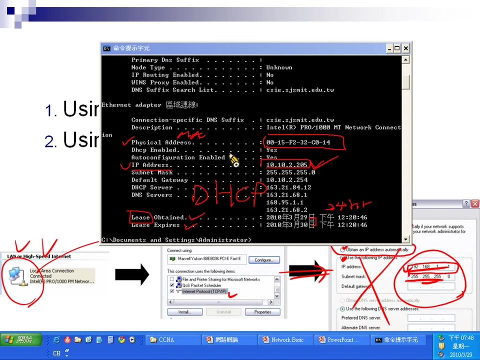

# chapter 2 - 1

插槽比Hub、Switch少，雖然Router也可以接電腦，但主要是用來連接網路設備\(Hub、Switch\)

## Logical Address \(邏輯位置\)

其實就是IP Address\(Internet Protocol\)

## Router 功能

### 1. 阻擋廣播封包

2號發了一個廣播訊息，會傳給左邊所有人包含Router，Router看到廣播封包，會把它阻擋下來，不會傳到其它網路區域

### 2. Network Segment\(劃分網路區域\)

Router port接出來的就是一個網路區域。以IP來畫分區域，例如左邊的網路區域編號是192.168.200，所以從192.168.200.1開始編號，1就是主機編號

### 3. Routing\(繞送\)

要送資料給不同網路區域，就要使用Routing，例如1號要發訊息給5號，透過Routing送達

### 筆記: 網路區域就是廣播區域

## 查IP

> DHCP: 動態分配IP 1. 在cmd下`ipconfig` 2. 查看網路屬性

如果使用DHCP，可以在cmd下`ipconfig /all`可以看到IP租約取得、租約失效的時間

## IP格式

IPv4: 32bits，每8個bit一組，總共4組最小0最大255的數字，組成如`192.168.200.2`的格式

## MAC 和 IP

MAC屬於L2 \(Layer 2\)  
 IP屬於L3 \(Layer 3\)

L2的設備稱為Switch，只能處理到MAC資訊，但是Switch也有L2與L3之分，L3 Switch的可以處理IP資訊  
 L3的設備稱為Router

資料傳送真正是靠MAC，IP只是輔助。先透過IP找到網路區域，再透過MAC送達資料

## ARP \(Address resolution protocol\)

> IP查詢MAC，稱為位址解析協定\(侷限在同一網路區域\) 1. 發出廣播訊息 2. 所有機器收到廣播訊息，並比對IP 3. IP相同就把MAC資訊傳回給送方。送方就可以加上Destination MAC來傳送訊息

電腦有cache\(快取\)，存IP對應MAC的資訊，這樣不用每次送資料的時候都要透過ARP來查MAC，在 CMD 輸入 `arp -a` 可以查詢cache table

| Internet Address | Physical Address |
| :--- | :--- |

| 192.168.1.7 | 0001.c969.0200 |
| :--- | :--- |

假如 `0001.c969.0200` 這台電腦IP從`192.168.1.7`換成了`192.168.1.10`，又有其它臺電腦註冊了 192.168.1.7 舊IP，我們還是透過 192.168.1.7 這個IP來傳送資料，會發現無法送達訊息。這時候要透過在CMD輸入 `arp -d` 清除cache

cache會在一段時間，或是電腦關機後失效

