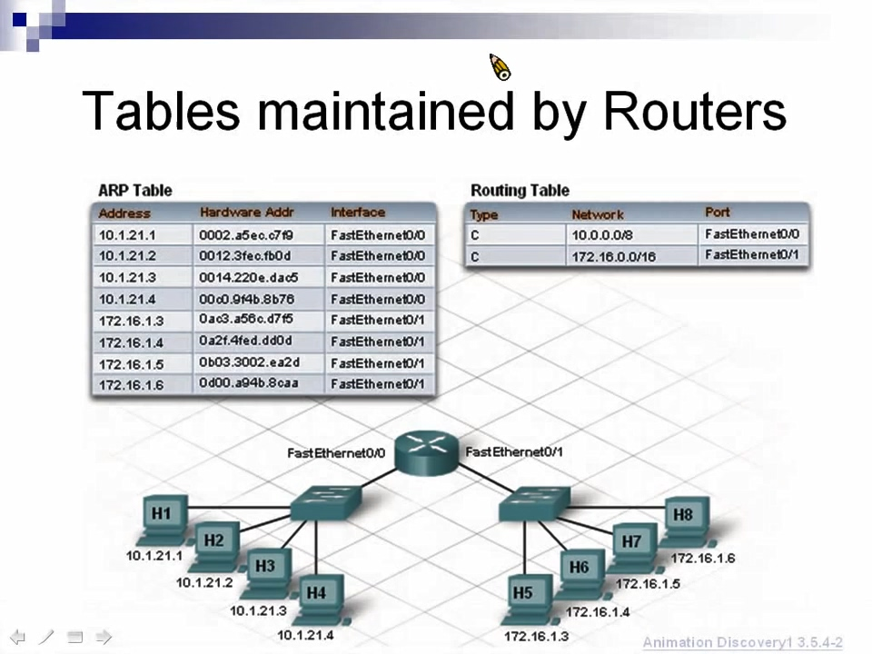

# chapter 2 - 2

## Routing \(繞送\)

Router的功能，詳見上一節 [chapter 2 - 1](2-1.md#router-功能)

 

前情提要: Router劃分網路區域，左邊的是10.0.0.0，右邊的是192.168.1.0，上面是172.16.0.0  
 今天一號想要送資料給四號，但是他們在不同的網路區域，一號無法透過[ARP](2-1.md#arp-address-resolution-protocol)取得四號的MAC，因為Router會把廣播封包給擋下來，這時候就要把封包交給Router，再透過Routing來傳送

### Routing table \(路由表\)

Routing經由Routing table來知道資料要往哪邊送

| port | 區域編號 |
| :--- | :--- |
| fa0/0 | 10.0.0.0 |
| fa0/1 | 172.16.0.0 |
| fa0/2 | 192.168.1.0 |

Router看到四號的IP是`192.168.1.2`，比對Routing table發現四號在`fa0/2`這個port的網路區域，於是把資料送到`192.168.1.0`這個區域，這時候就可以透過ARP來查四號的MAC，再把Destination MAC加上去，資料就成功送到四號手中

### 廣播封包

上一節也有提過，Router的另一個功能是阻擋廣播封包  
 L2 Destination MAC是`FF:FF:FF:FF:FF:FF`，L3 Destination IP是`255.255.255.255`，也就是目的地的bit全部都是1的時候，就是廣播封包，會發訊息給同個網路區域的所有人

## Default Gateway \(預設閘道\)

> 一個網路區域，對內、對外的代表，通常就是Router的port

Router的port就當作一個網路區域的gateway，注意**Router的port比較特殊**，把它當作一個小型的電腦，有IP、MAC。  
 送資料到不同的網路區域時，就要把資料交給gateway，gateway再送給Router做Routing的動作。反之，其它網路區域要送資料進來，也需透過這個default gateway

 

要送資料給其它網路區域，就要填上Default gateway，否則會找不到對外的窗口，這樣就沒辦法送資料出去  
 **筆記: Router的port可以設定IP，Switch的port沒辦法設IP**

## Router上的Table

#### 1. Routing Table

Routing的參考依據

#### 2. ARP Table

除了電腦有ARP Table外，Router也有ARP Table

一號 \(IP `10.1.21.1`\) 要送資料給八號 \(IP `172.16.1.6`\)，兩人在不同網域，所以一號先把資料送到Default Gateway，Gateway再送給Router，Router透過Routing Table知道八號所在的網路區域，再把資料送給八號的Default Gateway，並透過ARP來得知八號的MAC Address，最後把MAC存到ARP Table裡，此時就可以送資料給八號了!  
 **如果ARP Table有目的地的IP的話，送資料就不用再次ARP**

## LAN \(Local Area Network\) 區域網路

> 一個網路管理者，可以管轄的區域
>
> ## 擴充網路
>
> 1. 便宜作法
>
>    
>
>    缺點: 廣播區域內的電腦變多，發送廣播封包時，網路效能變差
>
> 2. 昂貴作法
>
>    
>
>    把要擴充的電腦放在另一個網路區域，跟舊的網路區域隔開

## 練習題目

1. 此封包透過哪一個Default Gateway送給Router?
2. Router收到此封包，哪一個interface\(port\)會把封包轉出去?

## 題目解答

1. 172.16.1.1
2. Ethernet1/3

