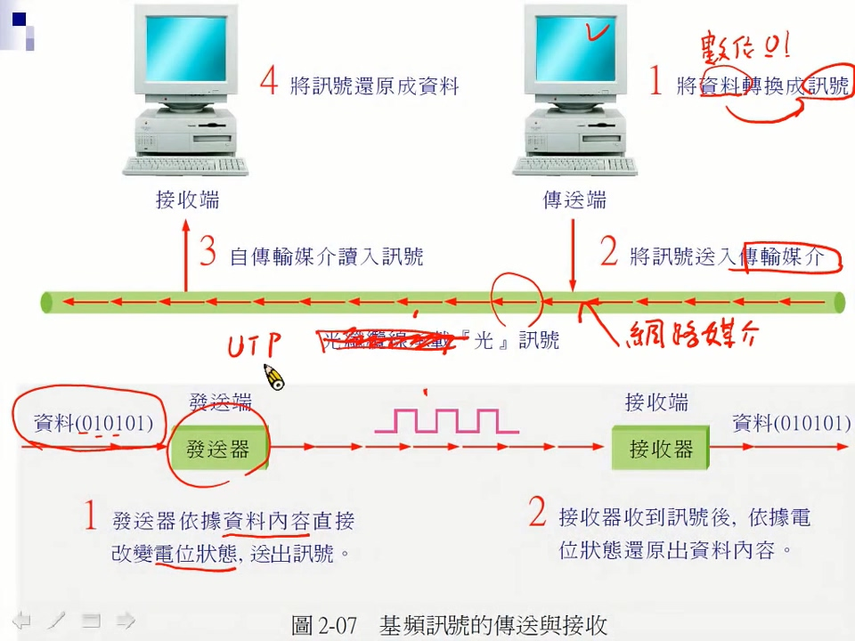
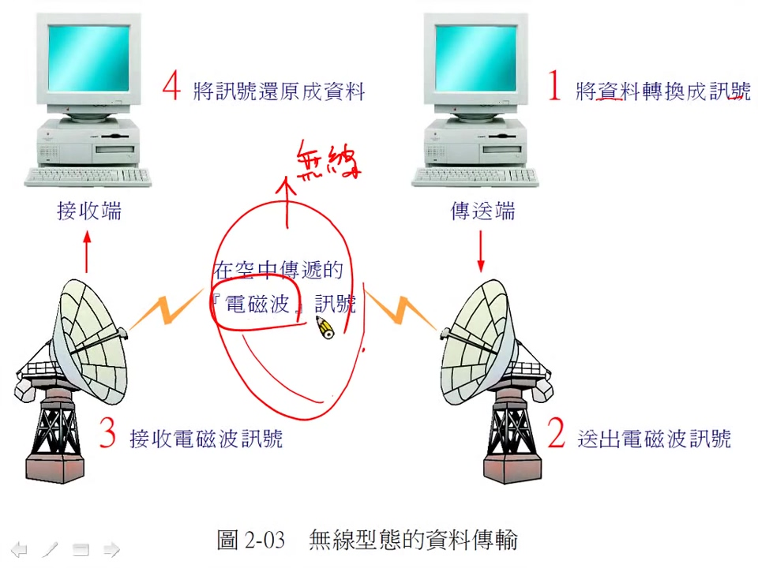
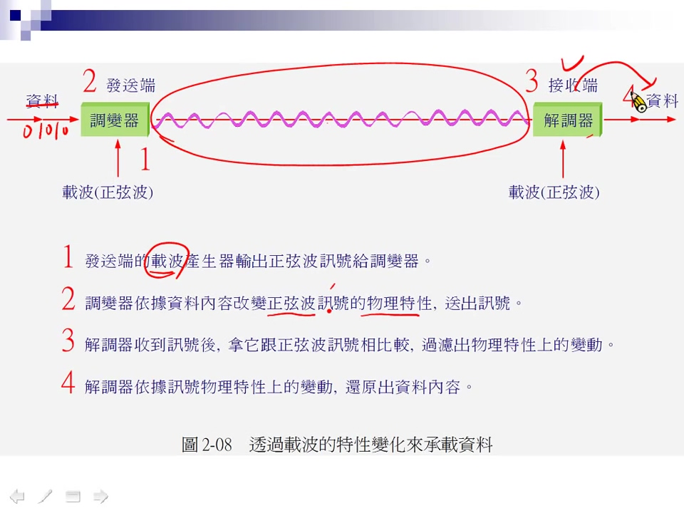

# chapter 3 - 1

由 ISO \(International Standards Organization\) 國際標準組織所訂定

| 7 | Application | 應用層 |
| :--- | :--- | :--- |
| 6 | Presentation | 表現層 |
| 5 | Session | 交談層 |
| 4 | Transport | 傳輸層 |
| 3 | Network | 網路層 |
| 2 | Data Link | 資料連結層 |
| 1 | Physical | 實體層 |

資料送的話從第7層開始處理，收的話從第1層開始處理。就像寄信一樣，先寫信、封裝在信封袋，再寄出一樣，每一層有一定的處理

## Layer 7 \(L7\) Application 應用層

應用程式，像是Browser \(IE、Chrome\) 使用HTTP協定，E-mail \(Outlook\) 送信使用SMTP，收信使用POP協定

每一個協定會對應一個port，像HTTP port是80

## Layer 6 \(L6\) Presentation 表現層

應用程式資料的表現方式，像是資料加密、資料的格式、資料結構

## Layer 5 \(L5\) Session 交談層

資料傳送前溝通的準備，包誇連線建立、管理

**上面三層 \(L7 ~ L5\) 都跟Application有關**

## Layer 4 \(L4\) 傳輸層

決定資料怎麼送，封包要切多大，分為兩種，一種是TCP像是掛號信，一種是UDP像是平信

## Layer 3 \(L3\) 網路層

一般是IP，即是住址

## Layer 2 \(L2\) 資料連結層

L2的地址是MAC

## Layer 1 \(L1\) 實體層

傳送的媒介，即是網路媒介，分為有線與無線傳送，電腦傳送訊號的時候以數位訊號\(0、1...\)傳送  
 光纖傳送以光的折射，雙軸線以電壓訊號

### [瞭解更多OSI...](https://ithelp.ithome.com.tw/articles/10000021)

## 有線傳輸

 

將資料轉為數位訊號\(0、1\)透過網路媒介\(線路\)傳送給接收端

## 無線傳輸

  

無線通過電磁波傳輸，接收端透過波形判斷接收到的資料是0還是1，轉成資料

