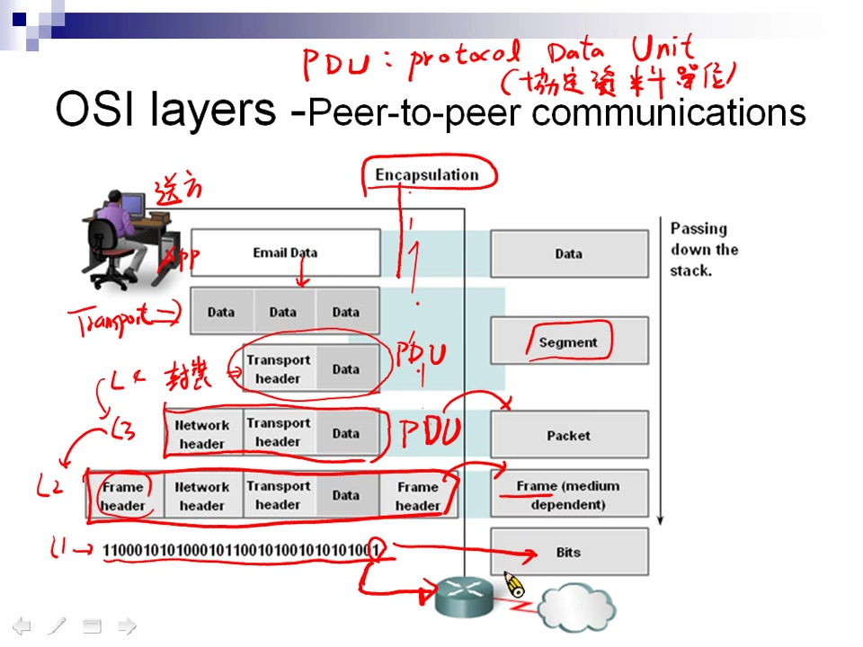
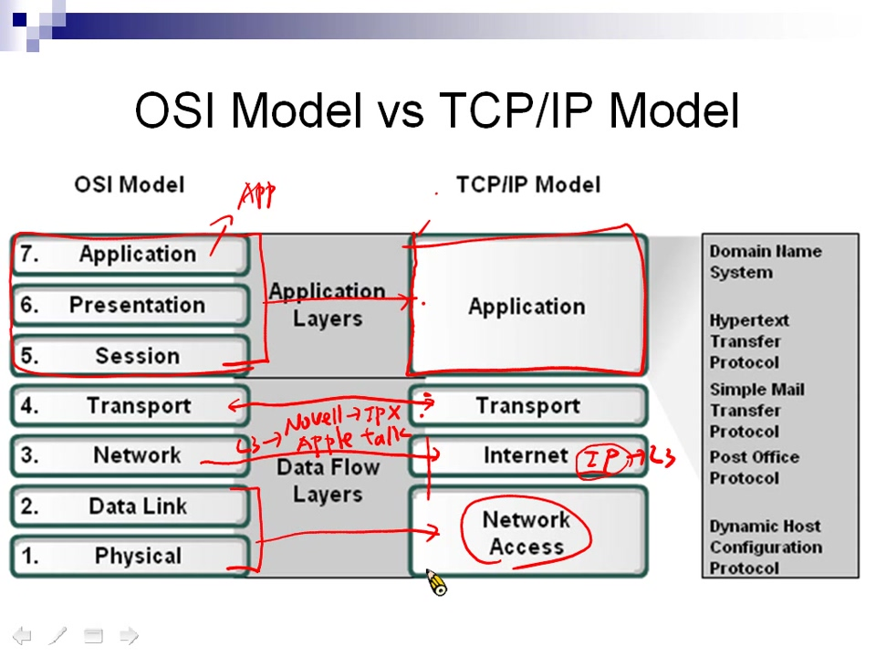
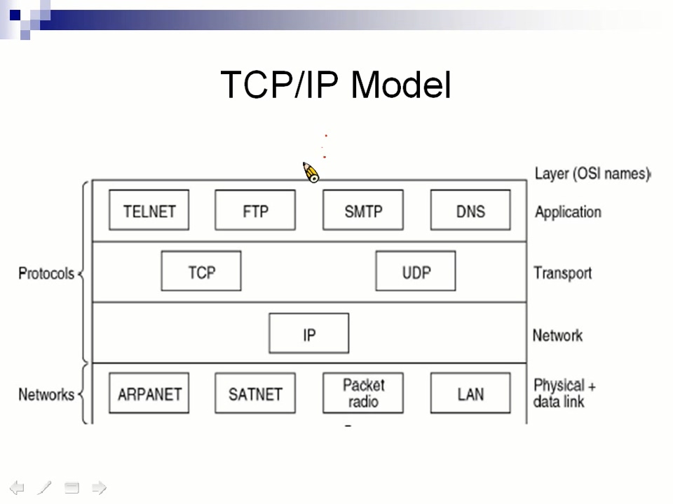
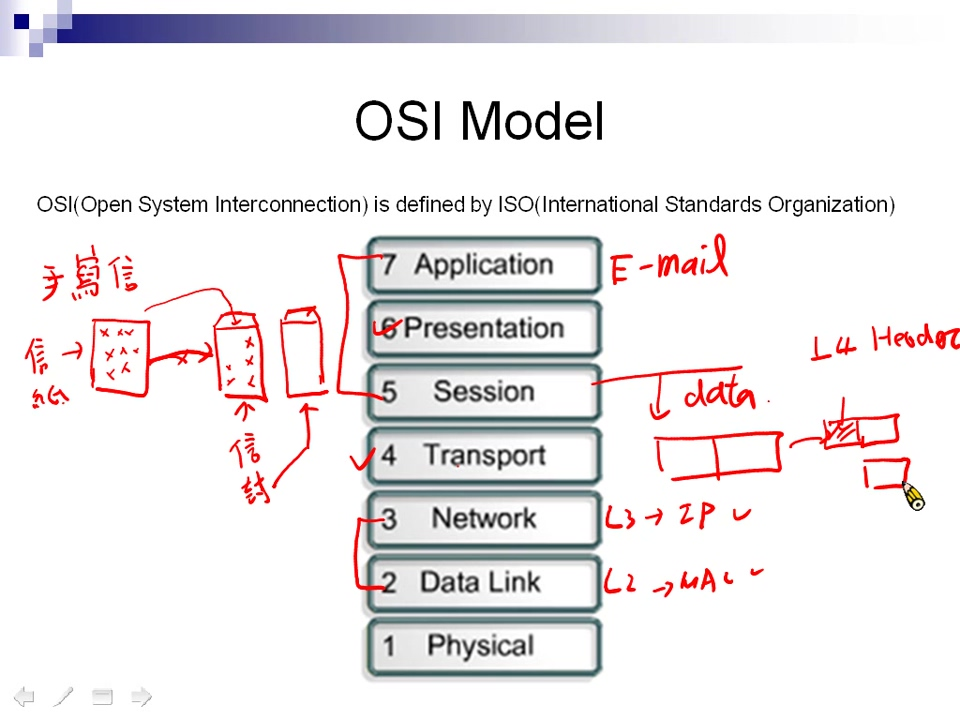

# chapter 3 - 2

| 7 | Application | 應用層 | 檔案、訊息、資料庫、應用程式 |
| :--- | :--- | :--- | :--- |
| 6 | Presentation | 表現層 | 資料加密、壓縮與轉換服務 |
| 5 | Session | 交談層/會談層 | 對話控制 |
|  |  |  |  |
| 4 | Transport | 傳輸層 | 終端對終端連線 |
| 3 | Network | 網路層 | 資料繞送 |
|  |  |  |  |
| 2 | Data Link | 資料連結層 | 訊框 |
| 1 | Physical | 實體層 | 實體拓樸 |

## OSI標準 點對點溝通

 資料從L7、L6、L5...，一直往下送並加工，這個動作稱為封裝，直到第4層Transport層，開始切割資料成合適大小，並且在前面加上表頭檔，傳到L3在前面加入IP資訊，L2在前面加入MAC資訊，最後到L1轉成數位資料傳送出去  
 接收端從數位訊號解析，往L2的方向一直拆包，這個動作稱為解封裝，L2解析完該層表頭檔後丟掉表頭檔繼續往上送，就完成解析封包

### 為什麼要定義OSI標準?

標準一樣才能正確地收發資料，就像溫度有攝氏與華氏之分，華氏20度和攝氏20度不一樣，講好使用哪種單位、方式才能正確地溝通

## PDU \(Protocol Data Unit\) 協定資料單位

 資料從App送下來，到Transport層\(L4\)切割資料成合適大小，在前面加上表頭，這時候的單位名稱是一個Segment

L4 PDU為Segment  
 L3 PDU為Packet\(封包\)  
 L2 PDU為Frame  
 L1 PDU為Bits  

## TCP/IP Model\(TCP/IP 模型\)

OSI由ISO所定義，TCP/IP由美國國防部\(DoD\)所定義  OSI L7~L5對應到TCP/IP的Application層，OSI L3對應到Internet層，注意Internet層不只有IP，還有其它的協定。網路模型對應協定很像一個沙漏，上面和下面有很多協定，中間比較少協定。

 Application層 SMTP協定為送信的協定  
 Transport層 TCP協定為掛號方式送信，UDP協定為平信方式送信  
 接下來會有章節專門講TCP與UDP

## OSI 七層複習

 像寫信一樣，在信紙上面寫上內容\(L7~L5產生應用程式資料\)，如果內容太多會裝到好幾個信封裡面\(L4把資料切割成適當大小\)，之後寫上送信與收信地址\(L3、L2的IP與MAC\)，最後交給郵差送信\(L1網路媒介送資料\)

## 練習題目

1. OSI七層排列哪個正確?

   

2. L2~L4的Destination和Source要填入甚麼?

   

3. 資料從L1~L7所對應的PDU

   

   **題目解答**

4. D
5. L2的地址填入MAC，L3填入IP，L4填入port  

   L4 Destination: 21, L4 Source: 31021

6. bits, frames, packets, segments, data

## 自我檢測

1. 網路模型的作用是什麼?
2. 網路模型有七層，七層分別意義是甚麼?
3. TCP/IP對應OSI Model

