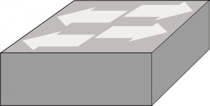
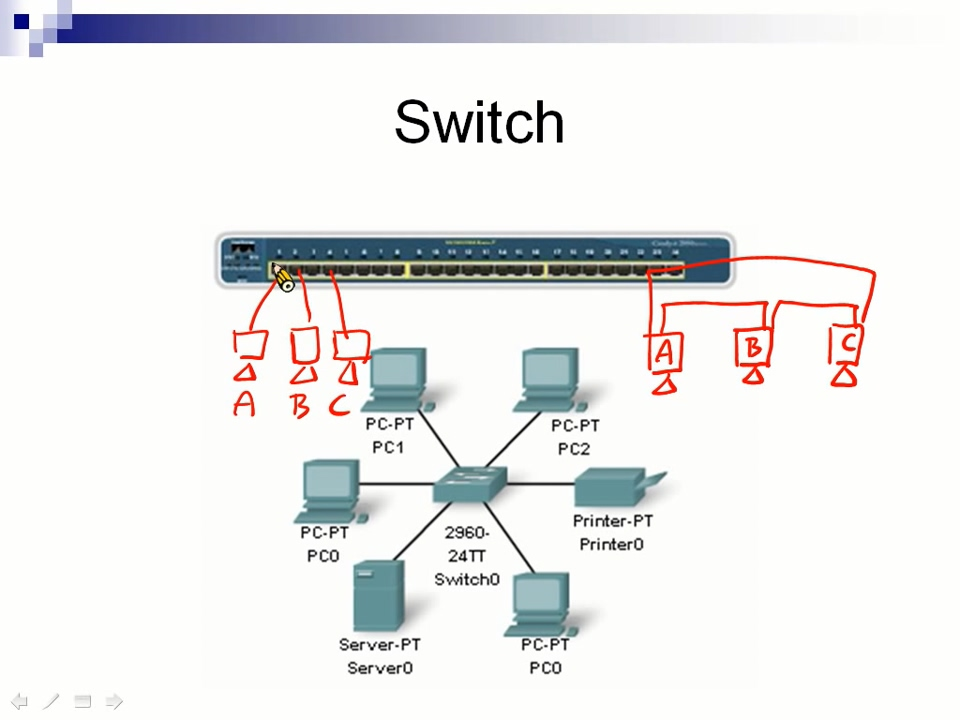
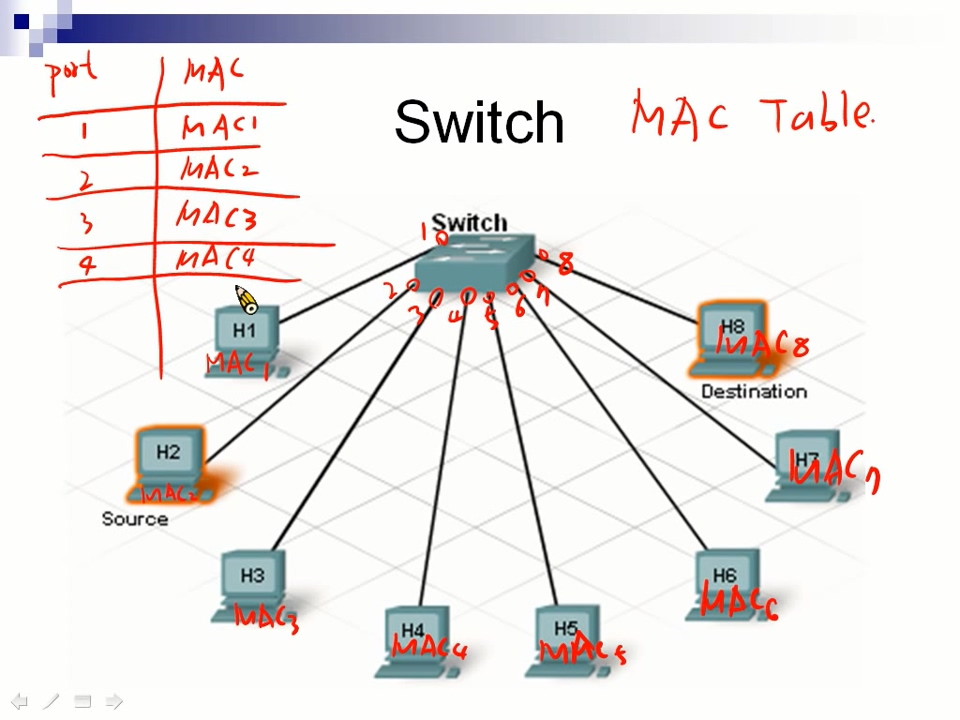
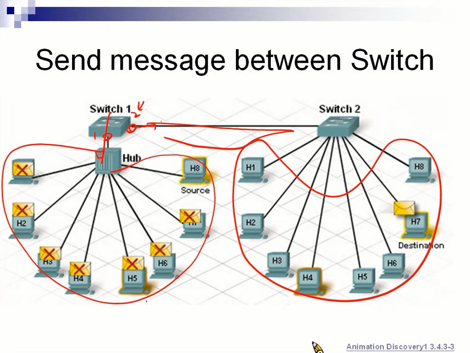
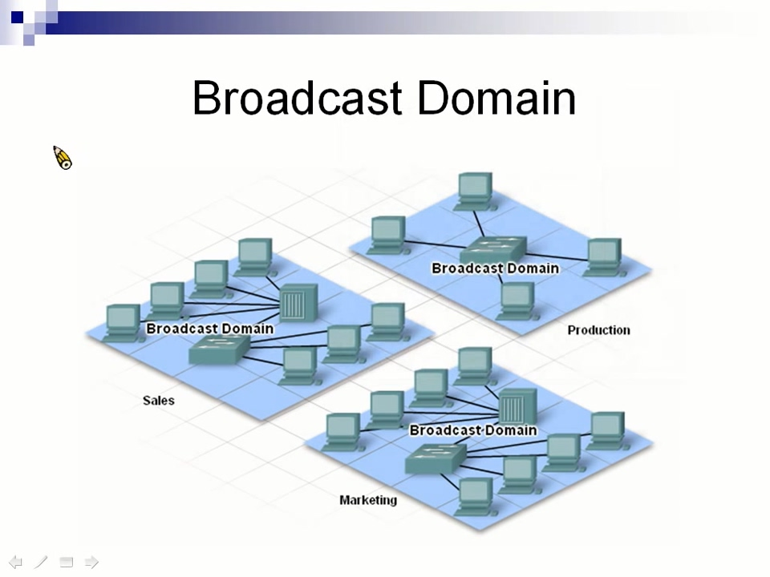
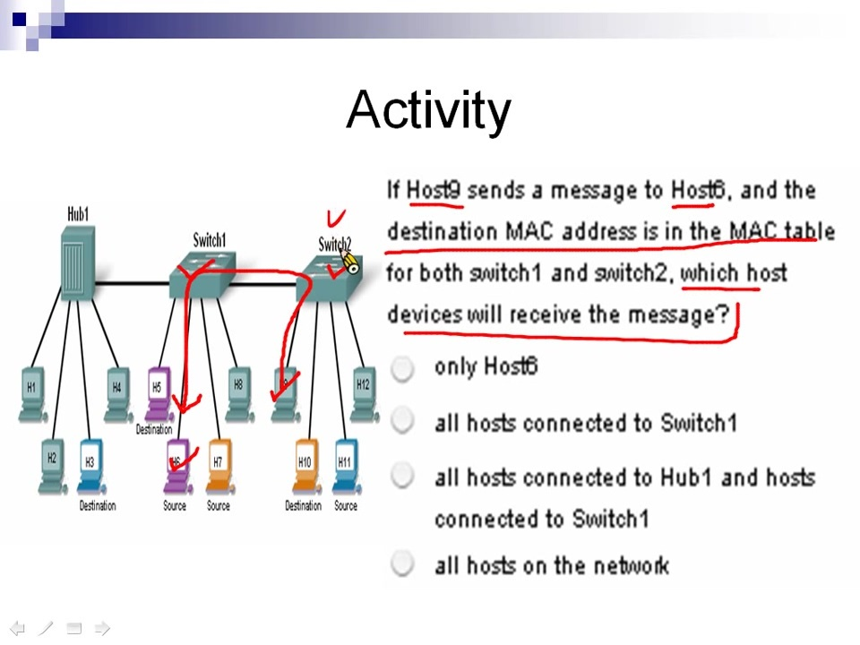
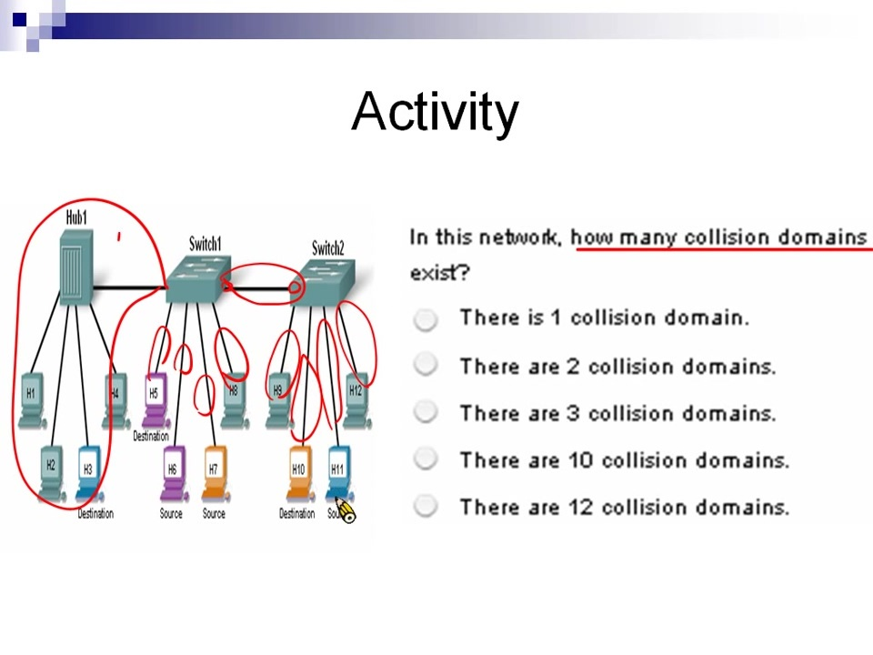
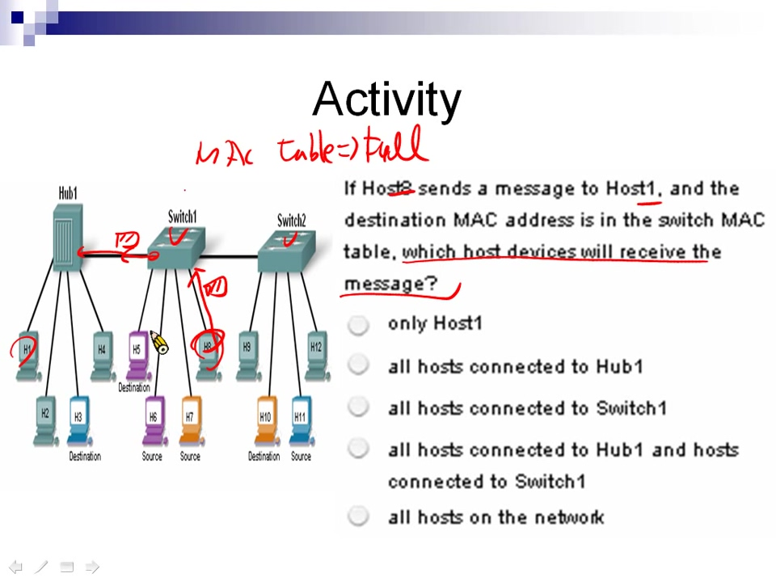
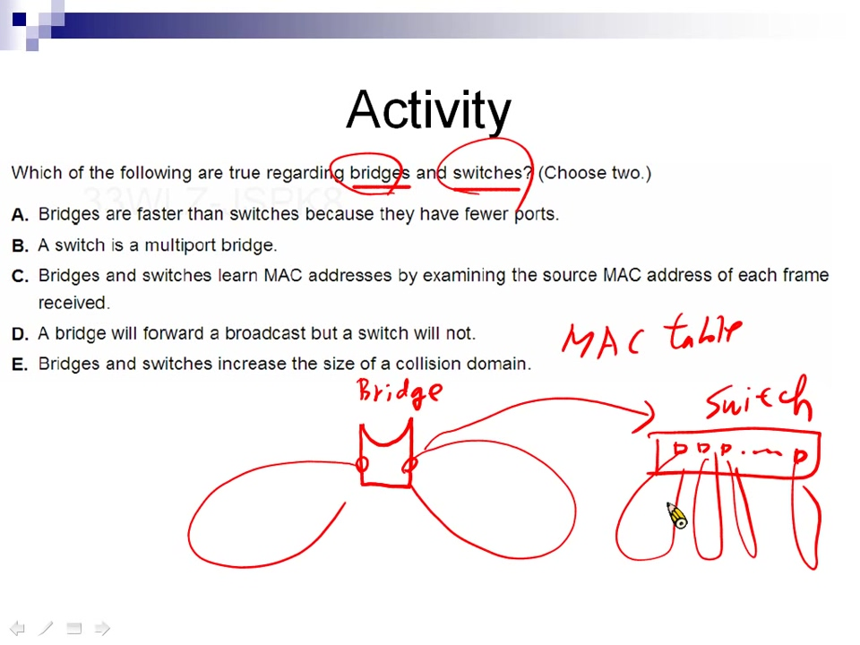
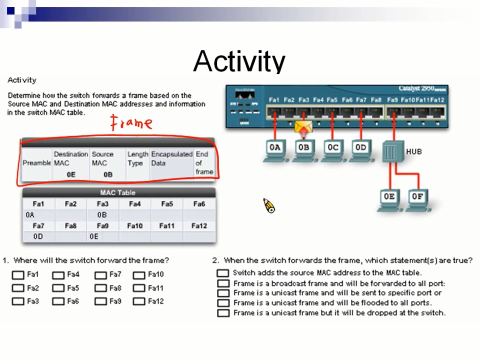

# chapter 1 - 3

## Switch \(交換器\)

外觀跟 Hub一模一樣，由機器上面的字來判斷是Hub還是Switch。

Switch icon:   
 

### Switch 特性

任意兩port，都是獨立的Shared bus，A、B、C 三台同時傳送資料，不會產生碰撞問題 

### Switch 發送資料

透過 MAC Table來送資料，MAC Table 紀錄 port 所接電腦的 MAC 

**1. MAC Table 找得到對應的 MAC**

如果1號要送資料給4號，會先把目的地的 MAC 加上去，Switch 查 MAC Table 發現對應到 4號 port，就送出資料

**2. MAC Table 找不到對應的 MAC**

如果1號要送資料給8號，在 MAC Table 裡面查不到，Switch會採取 Flooding的動作，來讓 8號收到資料

> Flooding: 每個port都送資料，跟 Hub運作一樣

**MAC Table 一開始是空的**，每次傳送訊息都要透過 Flooding，透過紀錄資料來源端的 port，慢慢把 MAC Table 建起來

### MAC Table

MAC Table 不是一對一的關係，也會有一對多的情況  圖中 Switch 1號 port 對應到左邊 Hub 接的 8台電腦。2號 port對應右邊 8台電腦

MAC Table:

| port | MAC |
| :--- | :--- |
| 1 | MAC1 |
| 1 | MAC2 |
| 1 | MAC3 |
| 1 | MAC4 |
| 1 | MAC5 |
| ... | ... |

#### 筆記: Switch 的每一個 port 就是一個碰撞區域

### Switch 送資料的方式

**1. Store-and-forward**

先儲存再轉送，確認資料沒有問題再傳送

**2. Cut-through**

直接傳送

## Broadcast message \(廣播訊息\)

> 目的地 MAC為 `FF:FF:FF:FF:FF:FF` 或是 IP 為 `255.255.255.255` 為廣播訊息

1. Switch 收到廣播訊息，會無條件送給所有人 
2. 收到訊息的電腦看到是廣播訊息，不會比較 MAC 直接收下訊息

## Broadcast Domain \(廣播區域\)

> 廣播訊息可以到達的地方

### 練習題目

1. Switch1 和 Switch2 的 MAC Table 完整的情況下，9號要送資料給 6號，哪些機器會收到資料?

   

2. 總共有幾個碰撞區域?

   

3. Switch1 和 Switch2 的 MAC Table 完整的情況下，8號要送資料給 1號，哪些機器會收到資料?

   

4. Bridge \(橋接器\)和 Switch 下列敘述何者正確?

   

5. 資料會送達哪一個 port?
6. 資料送達 port 後，以下哪些敘述正確?

   

   **題目解答**

7. 只有 6號會收到資料
8. 10個碰撞區域
9. Hub1 上面的機器都會收到資料
10. BC。   

    Bridge 為 Switch 的祖先，功能一模一樣，只是Switch有比較多 port，Bridge 只有兩個 port，它們都是透過 MAC Table來運作 

11. Source MAC 為 `0B`，Destination MAC 為 `0E`，資料從 0B 送到 0E，會查詢 MAC Table，找到 `0E` 對應 Fa9 port，所以資料會從第9個port出來
12. 資料為單播傳送，且送給特定 port

    > unicast \(單播\): 封包在傳輸中，目的位址為單一目標的一種傳輸方式

